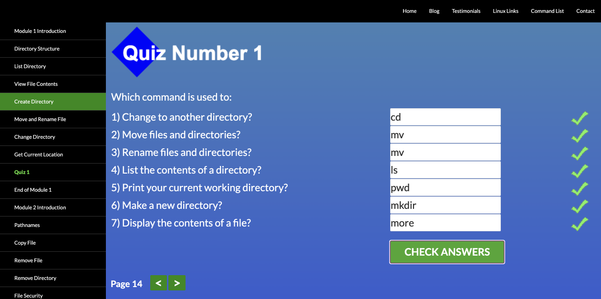
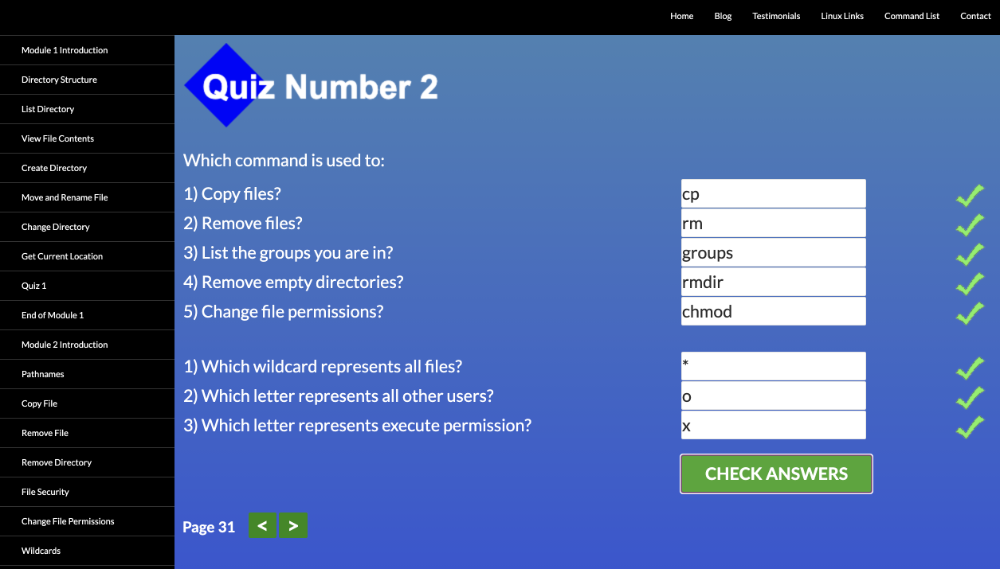
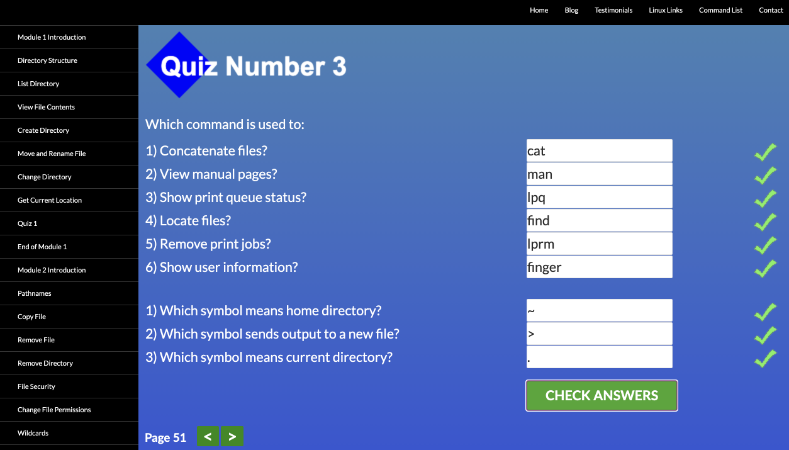
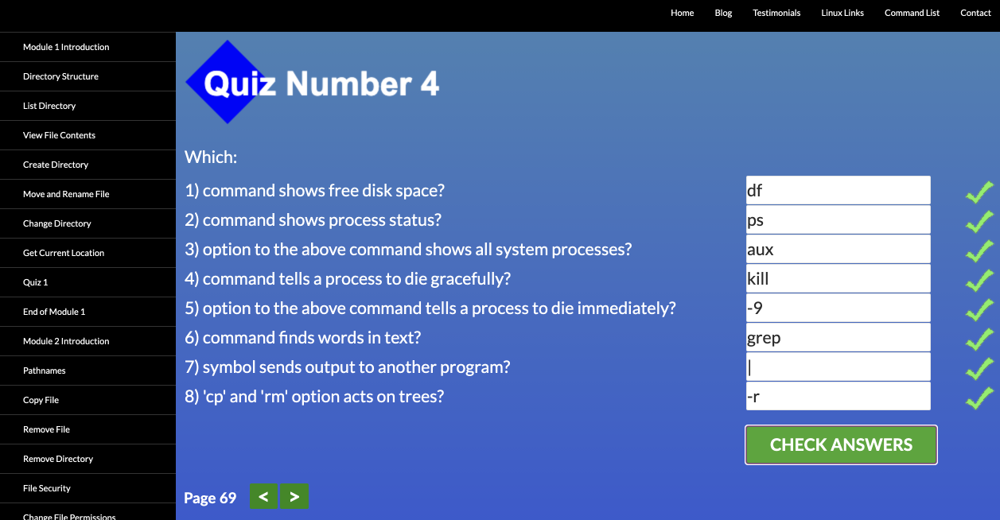
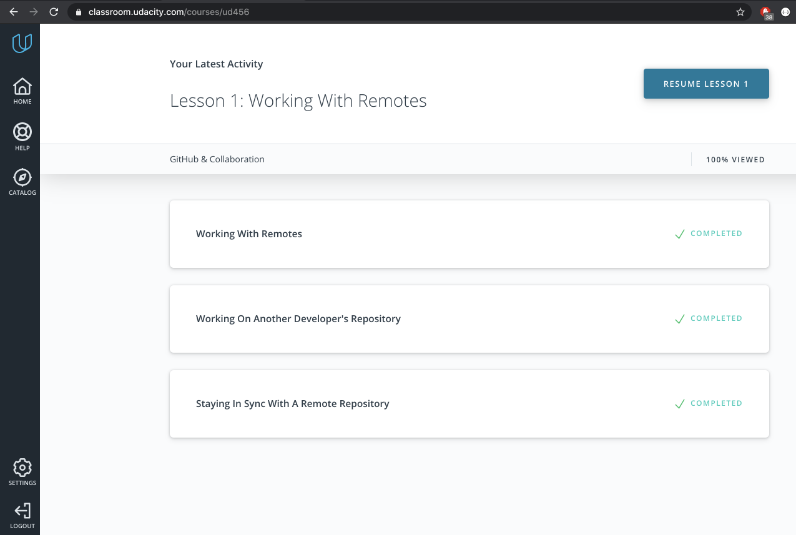
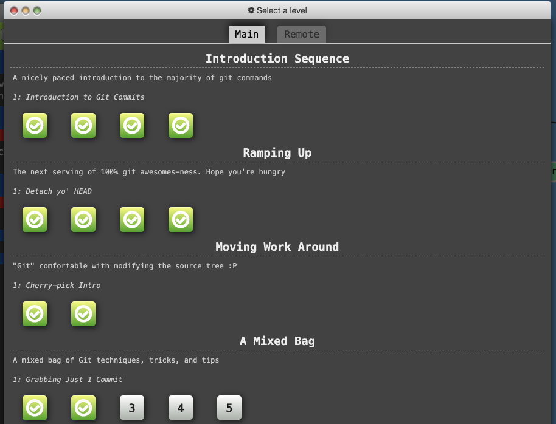
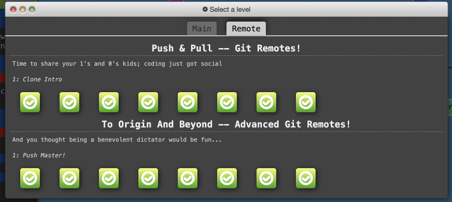

- [Git and GitHub](#git-and-github)
- [Linux CLI and HTTP](#linux-cli-and-http)
- [Git Collaboration](#git-collaboration)

# Git and GitHub

I've had some general idea about Git and basic concepts like commits, branches, merging and pull requests as I've had experience working in a development team as a tester. However how it all is done in practice seemed like rocket science to me (especially "scary" rebasing, cherry-picks and resolving merge conflicts). Now I see it is absolutely not :).  
Pretty much everything in the courses was **new to me**:

- making changes to commits with `git revert` and `git reset`
- working with remote repo with `git push`, `git fetch` and `git pull`
- juggling branches with `git rebase`, `git merge`, `git cherry-pick` etc.

**What surprised me** is how flexible Git is, as there is always a way to fix a mistake and it's quite hard to make a fatal one.

 
Screenshots:
  
 
 ### Version Control with Git at [udacity](https://www.udacity.com/course/version-control-with-git--ud123)
 

### Learn Git Branching at [learngitbranching](https://learngitbranching.js.org/)

# Linux CLI and HTTP

Nothing was new to me in the [linuxsurvival](https://linuxsurvival.com/) course, because I'd already known most basic commands in linux CLI and used them in my work.

 
Screenshots:
 
 
 |  |  |
 | --- | --- |
 |  |  |
 

As for the articles on HTTP I found interesting the second part, where specifics of HTTP connections, identification, authentication and caching are revealed. Most of this information was new to me. All I was familiar with before were HTTP request methods, response codes and structure of request and response messages.

# Git Collaboration

In the course [GitHub & Collaboration](https://classroom.udacity.com/courses/ud456) and new levels of [learngitbranching](https://learngitbranching.js.org/) I dug deeper into working with remote repositories and collaborating, via GitHub specifically.  
**What was new**:

- creating a connection to a remote repo with `git remote add origin <url>`
- details of forking and making a pull request in GitHub
- squashing commits with `git rebase -i`
- how to push (or fetch or pull) to different destinations with `git push origin <location>:<destination>`

 
Screenshots:
 
 

 

